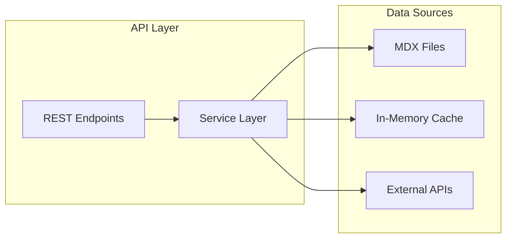

# API Reference Documentation

> Complete API reference for the Rajdeep Personal Website

## Table of Contents

- [Overview](#overview)
- [Service Architecture](#service-architecture)
- [API Endpoints](#api-endpoints)
- [Data Models](#data-models)
- [Service APIs](#service-apis)
- [Error Handling](#error-handling)
- [Best Practices](#best-practices)

## Overview

The application provides both REST API endpoints and internal service APIs for data management:

- **REST APIs** - External HTTP endpoints for newsletter, analytics
- **Service APIs** - Internal TypeScript APIs for data access
- **Type Safety** - Full TypeScript coverage with generated types
- **Error Handling** - Consistent error responses

## Service Architecture



## API Endpoints

### Newsletter Subscription

**POST** `/api/newsletter`

Subscribe email to newsletter.

#### Request

```typescript
{
  email: string // Valid email address
}
```

#### Response

```typescript
// Success (200)
{
  success: true,
  message: string
}

// Error (400/500)
{
  success: false,
  error: string
}
```

#### Example

```bash
curl -X POST https://rajdeepmondal.com/api/newsletter \
  -H "Content-Type: application/json" \
  -d '{"email": "user@example.com"}'
```

## Data Models

### Blog Post

```typescript
interface Blog {
  // Required fields
  title: string
  date: Date
  slug: string
  path: string

  // Optional fields
  draft?: boolean
  summary?: string
  images?: string[]
  authors?: string[]
  tags?: string[]
  lastmod?: Date
  layout?: 'PostSimple' | 'PostLayout' | 'PostBanner'
  bibliography?: string
  canonicalUrl?: string

  // Computed fields
  readingTime: ReadingTime
  toc: TableOfContents[]
  structuredData: StructuredData
  body: {
    raw: string
    code: string
  }
}
```

### Author

```typescript
interface Author {
  // Required fields
  name: string
  slug: string

  // Optional fields
  avatar?: string
  occupation?: string
  company?: string
  email?: string
  twitter?: string
  bluesky?: string
  linkedin?: string
  github?: string
  layout?: string

  // Computed fields
  readingTime: ReadingTime
  path: string
  body: {
    raw: string
    code: string
  }
}
```

### Tag

```typescript
interface Tag {
  name: string
  slug: string
  count: number
}
```

## Service APIs

### Post Service

```typescript
import { getAllPosts, getPostBySlug } from '@/lib/services'
```

#### getAllPosts()

Get all blog posts sorted by date.

```typescript
function getAllPosts(): Blog[]

// Usage
const posts = getAllPosts()
```

#### getPostBySlug(slug)

Get a single post by its slug.

```typescript
function getPostBySlug(slug: string): Blog

// Usage
try {
  const post = getPostBySlug('my-first-post')
} catch (error) {
  // Post not found
}
```

#### getPostsByTag(tag)

Get all posts with a specific tag.

```typescript
function getPostsByTag(tag: string): Blog[]

// Usage
const posts = getPostsByTag('javascript')
```

#### getPostNavigation(slug)

Get previous and next posts for navigation.

```typescript
function getPostNavigation(slug: string): {
  previousPost: Blog | null
  nextPost: Blog | null
}

// Usage
const { previousPost, nextPost } = getPostNavigation('current-post')
```

### Author Service

```typescript
import { getAllAuthors, getAuthorBySlug } from '@/lib/services'
```

#### getAllAuthors()

Get all authors.

```typescript
function getAllAuthors(): Author[]

// Usage
const authors = getAllAuthors()
```

#### getAuthorBySlug(slug)

Get author by slug.

```typescript
function getAuthorBySlug(slug: string): Author

// Usage
try {
  const author = getAuthorBySlug('default')
} catch (error) {
  // Author not found
}
```

#### getDefaultAuthor()

Get the default author.

```typescript
function getDefaultAuthor(): Author

// Usage
const author = getDefaultAuthor()
```

#### getAuthorDetailsForPost(authors)

Get author details for a blog post.

```typescript
function getAuthorDetailsForPost(authors?: string[]): (CoreContent<Author> | null)[]

// Usage
const authorDetails = getAuthorDetailsForPost(post.authors)
```

### Tag Service

```typescript
import { getTagCounts, getSortedTags } from '@/lib/services'
```

#### getTagCounts()

Get count of posts for each tag.

```typescript
function getTagCounts(): Record<string, number>

// Usage
const tagCounts = getTagCounts()
// { javascript: 5, react: 3, ... }
```

#### getSortedTags()

Get all tags sorted by count.

```typescript
function getSortedTags(): Tag[]

// Usage
const sortedTags = getSortedTags()
```

#### getPaginatedPostsByTag(tag, page, postsPerPage)

Get paginated posts for a tag.

```typescript
function getPaginatedPostsByTag(
  tag: string,
  page: number,
  postsPerPage: number = 5
): {
  posts: Blog[]
  totalPages: number
  currentPage: number
}

// Usage
const { posts, totalPages } = getPaginatedPostsByTag('react', 1, 10)
```

## Error Handling

### Error Types

```typescript
// Not Found Error
class NotFoundError extends Error {
  statusCode = 404
}

// Validation Error
class ValidationError extends Error {
  statusCode = 400
}

// Server Error
class ServerError extends Error {
  statusCode = 500
}
```

### Error Responses

All errors follow a consistent format:

```typescript
{
  error: string,        // Error message
  statusCode: number,   // HTTP status code
  details?: any        // Optional error details
}
```

### Handling Errors

```typescript
// In API routes
export async function POST(request: Request) {
  try {
    // Process request
    return Response.json({ success: true })
  } catch (error) {
    if (error instanceof ValidationError) {
      return Response.json({ error: error.message }, { status: 400 })
    }

    return Response.json({ error: 'Internal server error' }, { status: 500 })
  }
}

// In pages
try {
  const post = getPostBySlug(slug)
} catch (error) {
  notFound() // Next.js 404 page
}
```

## Best Practices

### 1. Always Handle Errors

```typescript
// ❌ Bad
const post = getPostBySlug(slug)

// ✅ Good
try {
  const post = getPostBySlug(slug)
} catch (error) {
  // Handle error appropriately
}
```

### 2. Use Type Guards

```typescript
// Type guard for author details
function isValidAuthor(author: CoreContent<Author> | null): author is CoreContent<Author> {
  return author !== null
}

// Usage
const validAuthors = authorDetails.filter(isValidAuthor)
```

### 3. Validate Input

```typescript
// API route validation
const schema = z.object({
  email: z.string().email(),
})

const result = schema.safeParse(body)
if (!result.success) {
  return Response.json({ error: 'Invalid email' }, { status: 400 })
}
```

### 4. Use Service Layer

```typescript
// ❌ Bad - Direct contentlayer import
import { allBlogs } from 'contentlayer/generated'
const posts = allBlogs

// ✅ Good - Use service layer
import { getAllPosts } from '@/lib/services'
const posts = getAllPosts()
```

### 5. Cache Expensive Operations

```typescript
// Service with caching
const cache = new Map()

function getExpensiveData(key: string) {
  if (cache.has(key)) {
    return cache.get(key)
  }

  const data = computeExpensiveData(key)
  cache.set(key, data)
  return data
}
```

## API Testing

### Unit Tests

```typescript
// __tests__/services/postService.test.ts
import { getAllPosts, getPostBySlug } from '@/lib/services'

describe('PostService', () => {
  test('getAllPosts returns sorted posts', () => {
    const posts = getAllPosts()
    expect(posts).toBeArray()
    expect(posts[0].date >= posts[1].date).toBe(true)
  })

  test('getPostBySlug throws for invalid slug', () => {
    expect(() => {
      getPostBySlug('invalid-slug')
    }).toThrow(NotFoundError)
  })
})
```

### Integration Tests

```typescript
// __tests__/api/newsletter.test.ts
describe('POST /api/newsletter', () => {
  test('subscribes valid email', async () => {
    const response = await fetch('/api/newsletter', {
      method: 'POST',
      body: JSON.stringify({ email: 'test@example.com' }),
      headers: { 'Content-Type': 'application/json' },
    })

    expect(response.status).toBe(200)
    const data = await response.json()
    expect(data.success).toBe(true)
  })
})
```

## Related Documentation

- [Service Architecture](../architecture/services.md) - Detailed service design
- [Type Definitions](./types.md) - Complete TypeScript types
- [Testing Guide](../development/testing.md) - Testing strategies
- [Error Handling](../guides/error-handling.md) - Error handling patterns
