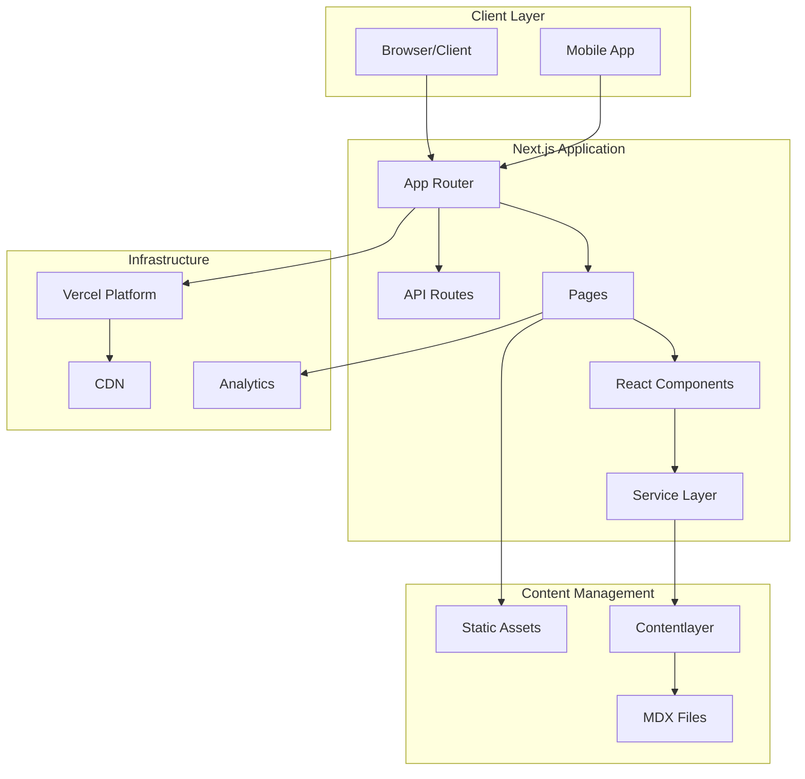

# Architecture Overview

> A comprehensive guide to the system architecture of Rajdeep Personal Website

## Table of Contents

- [High-Level Architecture](#high-level-architecture)
- [Core Components](#core-components)
- [Data Flow](#data-flow)
- [Design Principles](#design-principles)
- [Technology Decisions](#technology-decisions)
- [Security Architecture](#security-architecture)
- [Performance Architecture](#performance-architecture)

## High-Level Architecture

The application follows a modern JAMstack architecture with server-side rendering capabilities:



## Core Components

### 1. Next.js App Router

The application uses Next.js 15's App Router for:

- **Server Components** - Default rendering mode for optimal performance
- **Client Components** - Interactive UI elements with `'use client'` directive
- **Route Handlers** - API endpoints in `app/api/`
- **Layouts** - Shared UI across routes
- **Loading States** - Automatic loading UI
- **Error Boundaries** - Graceful error handling

### 2. Content Layer

Content management is handled through:

- **MDX Files** - Blog posts and author data in `data/`
- **Contentlayer** - Transforms MDX to type-safe JSON
- **Frontmatter** - Metadata for posts (title, date, tags)
- **Reading Time** - Automatic calculation
- **Table of Contents** - Generated from headings

### 3. Service Architecture

The application uses a service-oriented architecture:

```typescript
// Service Layer Structure
lib/
├── services/
│   ├── postService.ts      // Blog post operations
│   ├── authorService.ts    // Author data management
│   ├── tagService.ts       // Tag operations
│   └── base.ts            // Base service class
├── container.ts           // Dependency injection
└── types/                 // TypeScript definitions
```

### 4. Component Architecture

Components follow a hierarchical structure:

```
components/
├── ui/                    // Base UI components
│   ├── button.tsx
│   ├── card.tsx
│   └── ...
├── layouts/               // Page layouts
│   ├── PostLayout.tsx
│   ├── ListLayout.tsx
│   └── ...
└── [feature]/            // Feature-specific components
    ├── Header.tsx
    ├── Footer.tsx
    └── ...
```

## Data Flow

### 1. Static Generation Flow


### 2. Request Flow


## Design Principles

### 1. Performance First

- **Static Generation** - Pre-render pages at build time
- **Edge Caching** - CDN distribution for global performance
- **Code Splitting** - Automatic per-route bundles
- **Image Optimization** - Next.js Image component
- **Font Optimization** - Next/font for web fonts

### 2. Type Safety

- **TypeScript** - Full type coverage
- **Contentlayer Types** - Generated types for content
- **Strict Mode** - TypeScript strict configuration
- **Runtime Validation** - Zod schemas for API data

### 3. Developer Experience

- **Hot Reload** - Fast refresh in development
- **Error Boundaries** - Clear error messages
- **ESLint/Prettier** - Automated code formatting
- **Git Hooks** - Pre-commit validation

### 4. Scalability

- **Serverless** - Automatic scaling on Vercel
- **Static Assets** - CDN-delivered content
- **Incremental Builds** - Only rebuild changed content
- **API Routes** - Serverless functions for dynamic needs

## Technology Decisions

### Framework: Next.js 15

**Why Next.js?**

- Industry-standard React framework
- Excellent performance out of the box
- Strong TypeScript support
- Active community and ecosystem

**Key Features Used:**

- App Router for modern routing
- Server Components for performance
- API Routes for backend logic
- Image optimization
- Built-in SEO support

### Content: MDX + Contentlayer

**Why MDX?**

- Write content in Markdown
- Embed React components
- Full TypeScript support
- Great developer experience

**Why Contentlayer?**

- Type-safe content
- Build-time processing
- Automatic schema validation
- Hot reload support

### Styling: Tailwind CSS

**Why Tailwind?**

- Utility-first approach
- Small bundle sizes
- Dark mode support
- Responsive design
- Component variants with CVA

### Deployment: Vercel

**Why Vercel?**

- Native Next.js support
- Global edge network
- Automatic deployments
- Analytics integration
- Zero configuration

## Security Architecture

### Content Security

- **CSP Headers** - Strict Content Security Policy
- **CORS** - Controlled cross-origin access
- **Input Validation** - Server-side validation
- **XSS Protection** - Automatic escaping

### Infrastructure Security

- **HTTPS Only** - Enforced SSL/TLS
- **Security Headers** - HSTS, X-Frame-Options, etc.
- **Environment Variables** - Secure secret management
- **Rate Limiting** - API endpoint protection

## Performance Architecture

### Build-Time Optimization

- **Static Generation** - Pre-render at build time
- **Code Splitting** - Per-route bundles
- **Tree Shaking** - Remove unused code
- **Minification** - Compressed assets

### Runtime Optimization

- **Edge Caching** - Global CDN distribution
- **Image Optimization** - Responsive images
- **Font Loading** - Optimized web fonts
- **Lazy Loading** - Load components on demand

### Monitoring

- **Web Vitals** - Core Web Vitals tracking
- **Analytics** - User behavior insights
- **Error Tracking** - Runtime error monitoring
- **Performance Budgets** - Size limits

## Architecture Decisions Records (ADRs)

For detailed architecture decisions, see:

- [ADR-001: Choosing Next.js App Router](./decisions/adr-001-nextjs-app-router.md)
- [ADR-002: Content Management Strategy](./decisions/adr-002-content-management.md)
- [ADR-003: Styling Architecture](./decisions/adr-003-styling-architecture.md)
- [ADR-004: Deployment Platform](./decisions/adr-004-deployment-platform.md)

## Related Documentation

- [Services Architecture](./services.md) - Detailed service layer documentation
- [Component Architecture](./components.md) - Component design patterns
- [Performance Guide](../guides/performance.md) - Performance optimization
- [Security Guide](../guides/security.md) - Security best practices
