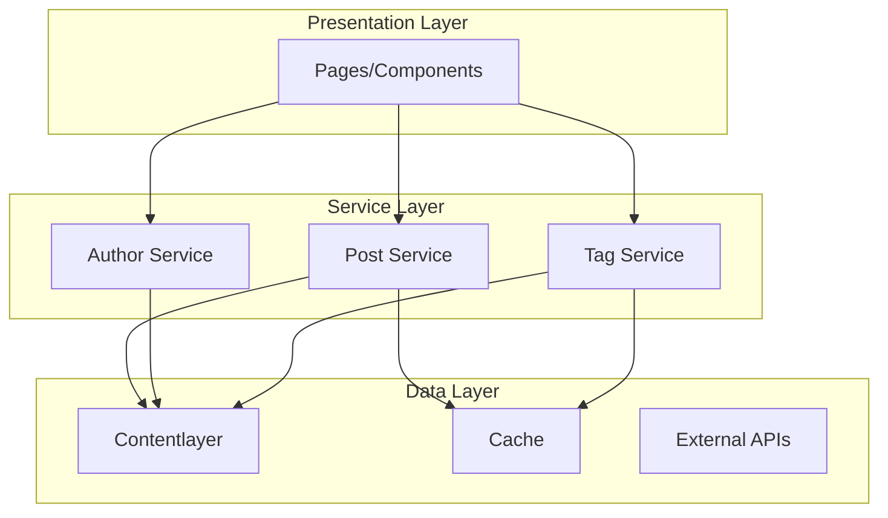

# Service Architecture Documentation

> Detailed guide to the service layer architecture and dependency injection system

## Table of Contents

- [Overview](#overview)
- [Architecture Pattern](#architecture-pattern)
- [Service Layer](#service-layer)
- [Dependency Injection](#dependency-injection)
- [Service Implementation](#service-implementation)
- [Testing Services](#testing-services)
- [Best Practices](#best-practices)

## Overview

The application uses a service-oriented architecture with dependency injection to:

- **Separate concerns** between data access and business logic
- **Enable testing** through dependency injection
- **Improve maintainability** with clear interfaces
- **Support scalability** through loose coupling

## Architecture Pattern



## Service Layer

### Service Structure

```
lib/
├── services/
│   ├── base.ts           # Base service class
│   ├── postService.ts     # Blog post operations
│   ├── authorService.ts   # Author management
│   ├── tagService.ts      # Tag operations
│   ├── container-setup.ts # DI configuration
│   └── index.ts          # Public exports
├── container.ts          # DI container
└── errors.ts            # Custom error types
```

### Base Service Class

```typescript
// lib/services/base.ts
export interface LoggerService {
  debug(message: string, data?: any): void
  info(message: string, data?: any): void
  warn(message: string, data?: any): void
  error(message: string, error?: any): void
}

export interface CacheService {
  get<T>(key: string): T | undefined
  set<T>(key: string, value: T, ttl?: number): void
  delete(key: string): void
  clear(): void
}

export abstract class BaseService {
  protected logger: LoggerService
  protected cache: CacheService

  constructor(logger: LoggerService, cache: CacheService) {
    this.logger = logger
    this.cache = cache
  }

  protected getCacheKey(...parts: string[]): string {
    return parts.join(':')
  }

  protected tryCache<T>(key: string, factory: () => T, ttl?: number): T {
    const cached = this.cache.get<T>(key)
    if (cached) {
      this.logger.debug(`Cache hit: ${key}`)
      return cached
    }

    const value = factory()
    this.cache.set(key, value, ttl)
    this.logger.debug(`Cache miss: ${key}`)
    return value
  }
}
```

## Dependency Injection

### Container Implementation

```typescript
// lib/container.ts
export class Container {
  private services = new Map<string, any>()
  private factories = new Map<string, () => any>()
  private singletons = new Map<string, any>()

  // Register a factory function
  register<T>(token: string, factory: () => T): void {
    this.factories.set(token, factory)
  }

  // Register a singleton instance
  registerInstance<T>(token: string, instance: T): void {
    this.services.set(token, instance)
  }

  // Register a singleton factory
  registerSingleton<T>(token: string, factory: () => T): void {
    this.factories.set(token, () => {
      if (!this.singletons.has(token)) {
        this.singletons.set(token, factory())
      }
      return this.singletons.get(token)
    })
  }

  // Resolve a service
  resolve<T>(token: string): T {
    // Check for direct instance
    if (this.services.has(token)) {
      return this.services.get(token)
    }

    // Check for factory
    if (this.factories.has(token)) {
      return this.factories.get(token)()
    }

    throw new Error(`Service ${token} not found`)
  }

  // Clear all registrations
  clear(): void {
    this.services.clear()
    this.factories.clear()
    this.singletons.clear()
  }
}

// Global container instance
export const container = new Container()
```

### Service Identifiers

```typescript
// lib/services/identifiers.ts
export const ServiceIdentifiers = {
  LoggerService: Symbol.for('LoggerService'),
  CacheService: Symbol.for('CacheService'),
  PostService: Symbol.for('PostService'),
  AuthorService: Symbol.for('AuthorService'),
  TagService: Symbol.for('TagService'),
} as const
```

### Container Setup

```typescript
// lib/services/container-setup.ts
import { container } from '../container'
import { ConsoleLogger } from './logger'
import { InMemoryCache } from './cache'
import * as postService from './postService'
import * as authorService from './authorService'
import * as tagService from './tagService'

export function initializeContainer(): void {
  // Register infrastructure services
  container.registerInstance(ServiceIdentifiers.LoggerService, new ConsoleLogger())

  container.registerInstance(ServiceIdentifiers.CacheService, new InMemoryCache())

  // Register domain services
  container.register(ServiceIdentifiers.PostService, () => ({
    getAllPosts: postService.getAllPosts,
    getPostBySlug: postService.getPostBySlug,
    getPostsByTag: postService.getPostsByTag,
    getPostNavigation: postService.getPostNavigation,
    getRelatedPosts: postService.getRelatedPosts,
  }))

  container.register(ServiceIdentifiers.AuthorService, () => ({
    getAllAuthors: authorService.getAllAuthors,
    getAuthorBySlug: authorService.getAuthorBySlug,
    getDefaultAuthor: authorService.getDefaultAuthor,
    getAuthorDetailsForPost: authorService.getAuthorDetailsForPost,
  }))

  container.register(ServiceIdentifiers.TagService, () => ({
    getTagCounts: tagService.getTagCounts,
    getSortedTags: tagService.getSortedTags,
    formatTagTitle: tagService.formatTagTitle,
    getPaginatedPostsByTag: tagService.getPaginatedPostsByTag,
  }))
}

// Initialize on import
initializeContainer()
```

## Service Implementation

### Post Service Example

```typescript
// lib/services/postService.ts
import { allBlogs, Blog } from 'contentlayer/generated'
import { compareDesc } from 'date-fns'
import { NotFoundError } from '../errors'
import { CoreContent } from 'pliny/utils/contentlayer'

const isProduction = process.env.NODE_ENV === 'production'

/**
 * Get all published blog posts sorted by date
 */
export function getAllPosts(): Blog[] {
  return allBlogs
    .filter((post) => !isProduction || !post.draft)
    .sort((a, b) => compareDesc(new Date(a.date), new Date(b.date)))
}

/**
 * Get a single post by slug
 * @throws {NotFoundError} if post not found
 */
export function getPostBySlug(slug: string): Blog {
  const post = allBlogs.find((p) => p.slug === slug)

  if (!post) {
    throw new NotFoundError(`Post with slug "${slug}" not found`)
  }

  if (isProduction && post.draft) {
    throw new NotFoundError(`Post "${slug}" is in draft mode`)
  }

  return post
}

/**
 * Get posts by tag
 */
export function getPostsByTag(tag: string): Blog[] {
  return getAllPosts().filter((post) => post.tags?.some((t) => slug(t) === tag))
}

/**
 * Get navigation for a post
 */
export function getPostNavigation(currentSlug: string): {
  previousPost: Blog | null
  nextPost: Blog | null
} {
  const posts = getAllPosts()
  const currentIndex = posts.findIndex((p) => p.slug === currentSlug)

  return {
    previousPost: currentIndex > 0 ? posts[currentIndex - 1] : null,
    nextPost: currentIndex < posts.length - 1 ? posts[currentIndex + 1] : null,
  }
}

/**
 * Get related posts based on shared tags
 */
export function getRelatedPosts(post: Blog, count: number = 3): CoreContent<Blog>[] {
  const relatedPosts = getAllPosts()
    .filter((p) => p.slug !== post.slug)
    .map((p) => ({
      post: p,
      score: calculateSimilarity(post, p),
    }))
    .sort((a, b) => b.score - a.score)
    .slice(0, count)
    .map((item) => item.post)

  return relatedPosts.map((p) => coreContent(p))
}

function calculateSimilarity(post1: Blog, post2: Blog): number {
  const tags1 = new Set(post1.tags || [])
  const tags2 = new Set(post2.tags || [])

  const intersection = [...tags1].filter((tag) => tags2.has(tag))
  const union = new Set([...tags1, ...tags2])

  return intersection.length / union.size
}
```

### Author Service Example

```typescript
// lib/services/authorService.ts
import { allAuthors, Authors } from 'contentlayer/generated'
import { NotFoundError } from '../errors'
import { coreContent, CoreContent } from 'pliny/utils/contentlayer'

/**
 * Get all authors
 */
export function getAllAuthors(): Authors[] {
  return allAuthors
}

/**
 * Get author by slug
 * @throws {NotFoundError} if author not found
 */
export function getAuthorBySlug(slug: string): Authors {
  const author = allAuthors.find((a) => a.slug === slug)

  if (!author) {
    throw new NotFoundError(`Author with slug "${slug}" not found`)
  }

  return author
}

/**
 * Get the default author
 * @throws {NotFoundError} if default author not found
 */
export function getDefaultAuthor(): Authors {
  return getAuthorBySlug('default')
}

/**
 * Get author details for a blog post
 */
export function getAuthorDetailsForPost(authorSlugs?: string[]): (CoreContent<Authors> | null)[] {
  if (!authorSlugs || authorSlugs.length === 0) {
    return [coreContent(getDefaultAuthor())]
  }

  return authorSlugs.map((slug) => {
    try {
      const author = getAuthorBySlug(slug)
      return coreContent(author)
    } catch {
      return null
    }
  })
}

/**
 * Check if author exists
 */
export function authorExists(slug: string): boolean {
  return allAuthors.some((a) => a.slug === slug)
}
```

## Testing Services

### Unit Testing

```typescript
// __tests__/services/postService.test.ts
import { getAllPosts, getPostBySlug } from '@/lib/services/postService'
import { NotFoundError } from '@/lib/errors'

// Mock contentlayer data
jest.mock('contentlayer/generated', () => ({
  allBlogs: [
    {
      slug: 'test-post-1',
      title: 'Test Post 1',
      date: '2024-01-01',
      draft: false,
      tags: ['javascript', 'testing'],
    },
    {
      slug: 'test-post-2',
      title: 'Test Post 2',
      date: '2024-01-02',
      draft: true,
      tags: ['typescript'],
    },
  ],
}))

describe('PostService', () => {
  describe('getAllPosts', () => {
    it('returns posts sorted by date descending', () => {
      const posts = getAllPosts()
      expect(posts[0].date > posts[1].date).toBe(true)
    })

    it('filters draft posts in production', () => {
      process.env.NODE_ENV = 'production'
      const posts = getAllPosts()
      expect(posts.every((p) => !p.draft)).toBe(true)
    })
  })

  describe('getPostBySlug', () => {
    it('returns post for valid slug', () => {
      const post = getPostBySlug('test-post-1')
      expect(post.title).toBe('Test Post 1')
    })

    it('throws NotFoundError for invalid slug', () => {
      expect(() => getPostBySlug('invalid')).toThrow(NotFoundError)
    })
  })
})
```

### Integration Testing

```typescript
// __tests__/integration/services.test.ts
import { container } from '@/lib/container'
import { ServiceIdentifiers } from '@/lib/services/identifiers'

describe('Service Integration', () => {
  beforeEach(() => {
    // Reset container
    container.clear()
    initializeContainer()
  })

  it('resolves services from container', () => {
    const postService = container.resolve(ServiceIdentifiers.PostService)
    expect(postService).toBeDefined()
    expect(postService.getAllPosts).toBeFunction()
  })

  it('services work together', () => {
    const postService = container.resolve(ServiceIdentifiers.PostService)
    const authorService = container.resolve(ServiceIdentifiers.AuthorService)

    const posts = postService.getAllPosts()
    const authorDetails = authorService.getAuthorDetailsForPost(posts[0].authors)

    expect(authorDetails).toBeArray()
  })
})
```

## Best Practices

### 1. Service Design Principles

```typescript
// ✅ Good - Single responsibility
export class PostService {
  getAllPosts(): Post[]
  getPostBySlug(slug: string): Post
  searchPosts(query: string): Post[]
}

// ❌ Bad - Too many responsibilities
export class BlogService {
  getAllPosts(): Post[]
  getAllAuthors(): Author[]
  getAllTags(): Tag[]
  sendNewsletter(): void
  generateRSS(): string
}
```

### 2. Error Handling

```typescript
// Define domain-specific errors
export class PostNotFoundError extends NotFoundError {
  constructor(slug: string) {
    super(`Post with slug "${slug}" not found`)
    this.name = 'PostNotFoundError'
  }
}

// Use in services
export function getPostBySlug(slug: string): Post {
  const post = findPost(slug)
  if (!post) {
    throw new PostNotFoundError(slug)
  }
  return post
}

// Handle in pages
try {
  const post = getPostBySlug(params.slug)
  return <PostLayout post={post} />
} catch (error) {
  if (error instanceof PostNotFoundError) {
    notFound()
  }
  throw error
}
```

### 3. Caching Strategy

```typescript
export class CachedPostService extends BaseService {
  private readonly CACHE_TTL = 5 * 60 * 1000 // 5 minutes

  getAllPosts(): Post[] {
    return this.tryCache('posts:all', () => this.fetchAllPosts(), this.CACHE_TTL)
  }

  getPostBySlug(slug: string): Post {
    return this.tryCache(`posts:${slug}`, () => this.fetchPostBySlug(slug), this.CACHE_TTL)
  }

  invalidatePost(slug: string): void {
    this.cache.delete(`posts:${slug}`)
    this.cache.delete('posts:all')
  }
}
```

### 4. Service Composition

```typescript
// Compose services for complex operations
export class BlogFacadeService {
  constructor(
    private postService: PostService,
    private authorService: AuthorService,
    private tagService: TagService
  ) {}

  async getBlogPageData(page: number) {
    const [posts, tags, authors] = await Promise.all([
      this.postService.getPaginatedPosts(page),
      this.tagService.getPopularTags(),
      this.authorService.getFeaturedAuthors(),
    ])

    return { posts, tags, authors }
  }
}
```

### 5. Testing Strategies

```typescript
// Use dependency injection for testability
export class PostService {
  constructor(
    private dataSource: DataSource,
    private cache: CacheService,
    private logger: LoggerService
  ) {}
}

// In tests, inject mocks
const mockDataSource = createMockDataSource()
const mockCache = createMockCache()
const mockLogger = createMockLogger()

const service = new PostService(mockDataSource, mockCache, mockLogger)
```

## Related Documentation

- [Architecture Overview](./overview.md) - System architecture
- [API Documentation](../api/README.md) - Service API reference
- [Testing Guide](../development/testing.md) - Testing strategies
- [Error Handling](../guides/error-handling.md) - Error patterns
